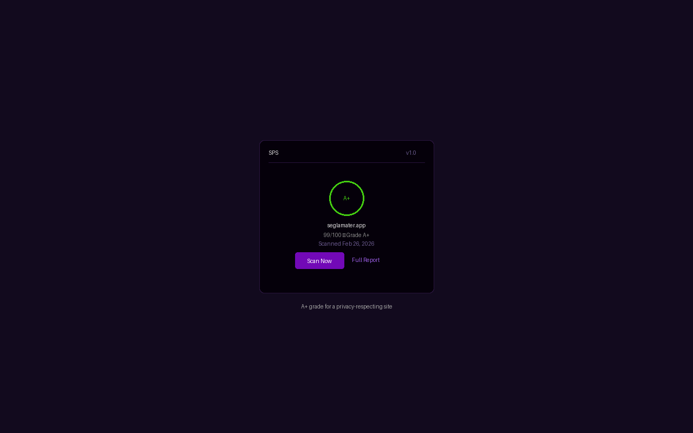
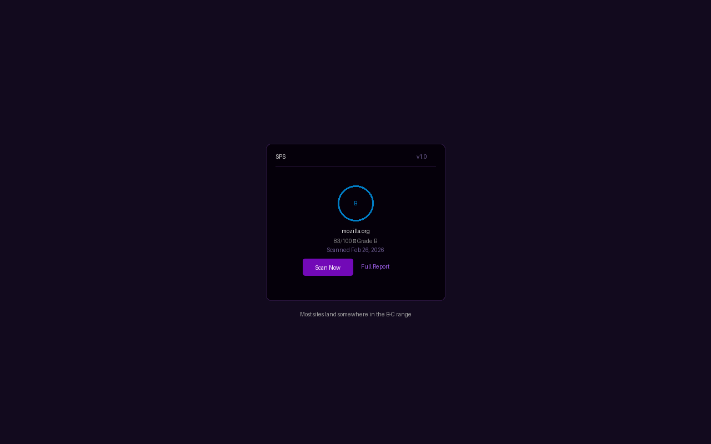
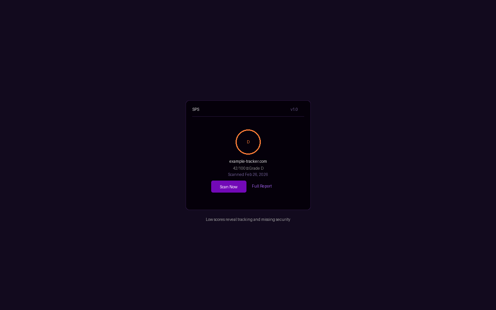

# SPS Browser Extension

A browser extension that shows the [Seglamater Privacy Standard](https://seglamater.app/privacy) grade for every website you visit.

  

## What It Does

- Shows the SPS letter grade (A+ through F) as a badge on the toolbar icon
- Click the icon to see the score, grade, and scan date
- "Scan Now" triggers a fresh scan for the current domain
- "Full Report" opens the detailed result on seglamater.app

## How It Works

The extension checks each site in three tiers to minimize network traffic:

1. **Local cache** -- Results are cached for 24 hours. Zero network calls if cached.
2. **Server lookup** -- If not cached locally, checks if seglamater.app has a previous scan result.
3. **Manual scan** -- If no result exists, you can trigger a scan with the "Scan Now" button.

Scans are never triggered automatically. Only domain lookups happen on page load.

## Install

### Chrome / Edge / Brave (developer mode)

1. Go to `chrome://extensions`
2. Enable "Developer mode" (top right)
3. Click "Load unpacked"
4. Select this directory

### Firefox (temporary)

1. Go to `about:debugging#/runtime/this-firefox`
2. Click "Load Temporary Add-on"
3. Select `manifest.json` from this directory

## Privacy

This extension sends **only the domain name** (e.g., `github.com`) to `seglamater.app` for lookup or scanning. It does not:

- Collect or transmit any personal data
- Track browsing history
- Read page content
- Set cookies
- Send data to any third party

Cached results are stored locally in extension storage and expire after 24 hours.

In incognito/private mode, the extension is fully disabled -- no lookups, no badge, no data stored.

## Permissions

| Permission | Why |
|-----------|-----|
| `activeTab` | Read the current tab's URL to extract the domain |
| `storage` | Cache scan results locally for 24 hours |
| `tabs` | Update the badge when switching between tabs |
| `seglamater.app` | API calls for domain lookup and scanning |

## Building for Distribution

The extension has no build step -- all files are ready to use as-is.

For web store submission, zip the root of this repository:

```bash
zip -r sps-extension.zip . -x ".git/*" "screenshots/*" ".gitignore" "CLAUDE.md"
```

- **Chrome Web Store**: Upload the zip
- **Firefox Add-ons**: Upload the same zip

## Development

### File Structure

```
manifest.json       Extension configuration (Manifest V3)
background.js       Service worker -- cache, API calls, badge updates
popup.html          Popup layout
popup.js            Popup behavior and state management
popup.css           Popup styling (dark purple theme)
icons/              Extension icons (16, 48, 128)
screenshots/        Store listing screenshots
```

### API Endpoints Used

The extension communicates with `https://seglamater.app/api/privacy`:

- `GET /verify/{domain}` -- Look up latest scan result
- `POST /scan` -- Trigger a new scan (body: `{"domain": "..."}`)

The scanner itself is open source: [github.com/purpleneutral/sps](https://github.com/purpleneutral/sps)

## Contributing

Contributions are welcome. For bug reports or feature requests, open an issue.

For code contributions:

1. Fork the repository
2. Create a feature branch
3. Test the extension locally (load unpacked in Chrome or temporary in Firefox)
4. Open a pull request with a clear description

## License

GPL-3.0-only. See [LICENSE](LICENSE).
